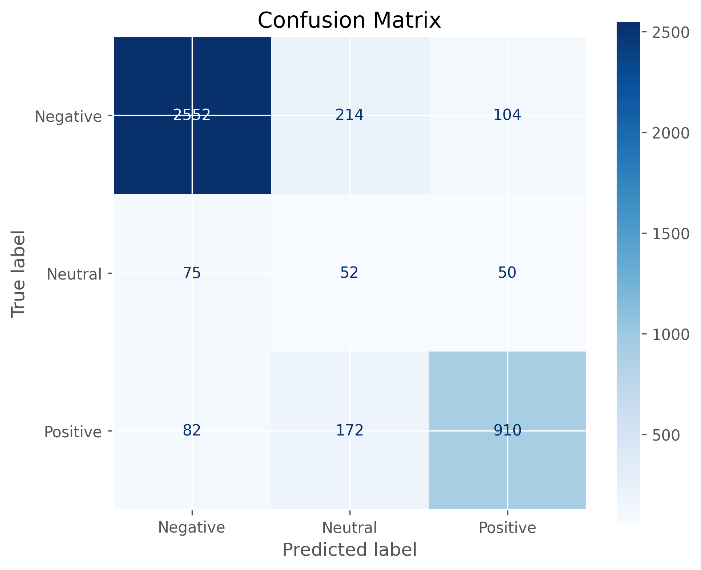
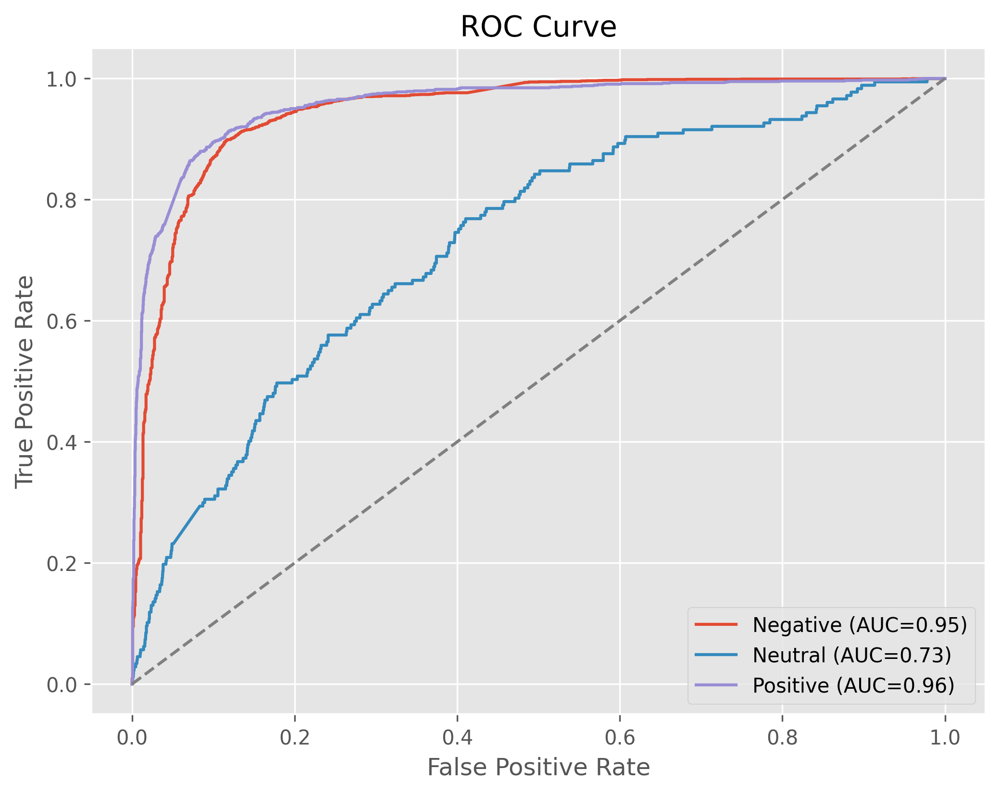
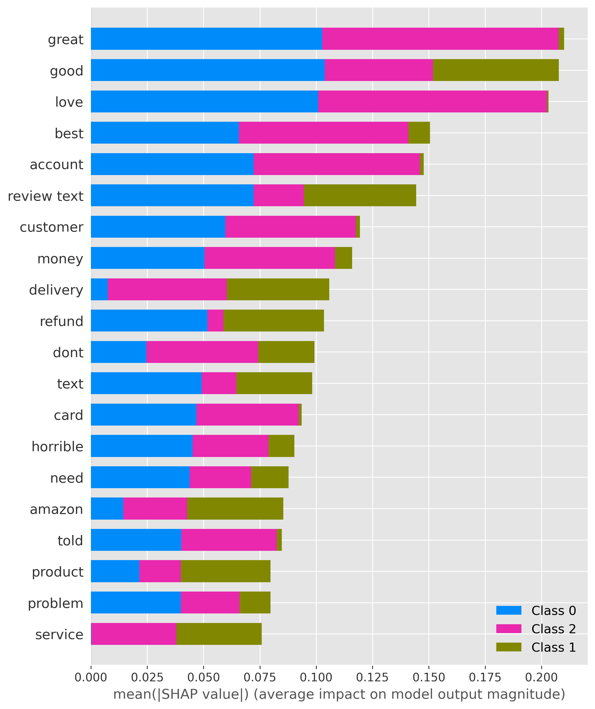

<p align="center">


</p>

<h1 align="center">

InsightPulse AI

</h1>

<p align="center">

<b>Customer Sentiment Intelligence Platform</b>

</p>

<p align="center">

Transforming customer feedback into actionable business intelligence using Machine Learning, Natural Language Processing, Explainable AI, Power BI, and Streamlit.

</p>

---

<p align="center">


</p>

---

# Overview

InsightPulse AI is an end-to-end customer sentiment intelligence platform developed using a real-world e-commerce case study for **ShopEase Europe**.

The platform automatically analyses customer reviews, predicts customer sentiment, identifies the key drivers behind customer satisfaction and dissatisfaction, and presents business insights through interactive dashboards and a modern web application.

Rather than simply predicting sentiment, InsightPulse AI enables organisations to understand **why** customers feel the way they do, supporting faster and more informed business decisions.

---

# Business Problem

ShopEase Europe receives thousands of customer reviews every day from multiple countries and digital channels.

Manual analysis of this feedback had become increasingly difficult because of:

- Growing review volumes
- Inconsistent manual categorisation
- Slow reporting
- Limited visibility into customer pain points

As a result, opportunities to improve customer experience were often identified too late.

InsightPulse AI was developed to automate this process.

---

# Solution

InsightPulse AI provides a complete analytics pipeline that transforms raw customer reviews into business intelligence.

### Core Features

- Automated sentiment prediction
- Customer review preprocessing
- Language detection
- TF-IDF feature extraction
- Machine Learning classification
- SHAP Explainability
- Power BI dashboard
- Streamlit web application
- Batch prediction
- Interactive reporting

---

# Workflow

<p align="center">


</p>

The project follows an end-to-end machine learning workflow:

1. Data Collection
2. Data Cleaning
3. Exploratory Data Analysis
4. Text Preprocessing
5. Feature Engineering
6. Model Development
7. Model Evaluation
8. Explainable AI (SHAP)
9. Dashboard Development
10. Streamlit Deployment

---

# System Architecture

<p align="center">


</p>

---

# Dataset

The dataset consists of approximately **16,800+ anonymised customer reviews** collected over an 18-month period.

## Features

| Feature | Description |
|----------|-------------|
| Review ID | Unique review identifier |
| Product Category | Purchased product category |
| Timestamp | Review submission date |
| Country | Customer country |
| Rating | Customer rating (1–5) |
| Review | Free-text customer feedback |
| Sentiment | Target variable |

---

# Technology Stack

| Category | Technology |
|------------|---------------------------|
| Programming | Python |
| Data Analysis | Pandas, NumPy |
| NLP | NLTK, spaCy, langdetect |
| Machine Learning | Scikit-learn, XGBoost |
| Explainability | SHAP |
| Visualisation | Matplotlib, Plotly |
| Dashboard | Power BI |
| Deployment | Streamlit |
| Version Control | Git & GitHub |

---

# Project Structure

```text
INSIGHTPULSE_AI/

├── app.py
├── README.md
├── requirements.txt
├── LICENSE
│
├── assets/
├── data/
├── docs/
├── models/
├── notebooks/
├── outputs/
└── powerbi/
```

---

# Exploratory Data Analysis

Several exploratory analyses were performed to better understand customer behaviour.

These included:

- Sentiment Distribution
- Rating Distribution
- Country Distribution
- Product Category Analysis
- Monthly Trends
- Review Length Distribution
- Language Distribution

<p align="center">


</p>

---

# Machine Learning Pipeline

The following models were evaluated.

| Model | Status |
|----------|-----------|
| Logistic Regression | ✅ Selected |
| Naïve Bayes | Evaluated |
| Random Forest | Evaluated |
| Linear SVM | Evaluated |
| XGBoost | Evaluated |

---

# Model Performance

The final Logistic Regression model demonstrated strong predictive performance across all sentiment classes.

Evaluation metrics included:

- Accuracy
- Precision
- Recall
- F1 Score
- ROC Curve
- Confusion Matrix

<p align="center">




</p>

---

# Explainable AI

Understanding model predictions is critical for business adoption.

SHAP (SHapley Additive Explanations) was used to explain individual predictions and overall model behaviour.

The analysis identified the words and phrases that most strongly influenced customer sentiment.

<p align="center">



</p>

---

# Power BI Dashboard

The Power BI dashboard enables business users to explore customer feedback through interactive visualisations.

### Dashboard Features

- KPI Cards
- Sentiment Distribution
- Product Category Analysis
- Country Analysis
- Monthly Trends
- Customer Ratings
- Sentiment Drivers

<p align="center">


</p>

---

# Streamlit Application

The Streamlit application allows users to interact with the model in real time.

### Features

- Single Review Prediction
- Batch CSV Prediction
- Interactive Dashboard
- Download Predictions

<p align="center">


</p>

---

# Business Value

InsightPulse AI enables organisations to:

- Reduce manual review analysis
- Improve customer satisfaction
- Identify recurring customer complaints
- Support operational decision-making
- Monitor customer experience in real time
- Improve product quality
- Strengthen customer loyalty

---

# Future Enhancements

The platform can be extended through:

- DistilBERT
- Multilingual BERT
- Aspect-Based Sentiment Analysis
- Docker Deployment
- Azure Cloud Deployment
- REST API
- CI/CD Pipeline
- Real-Time Streaming Analytics

---

# Installation

Clone the repository.

```bash
git clone https://github.com/yourusername/InsightPulse-AI.git
```

Move into the project.

```bash
cd InsightPulse-AI
```

Install dependencies.

```bash
pip install -r requirements.txt
```

Download the spaCy language model.

```bash
python -m spacy download en_core_web_sm
```

Run the application.

```bash
streamlit run app.py
```

---

# Author

## Godswill Chukwu

**Data Scientist | Data Analyst | Machine Learning Engineer**

**MSc Big Data and Data Science Technology**

---

# Acknowledgements

This project was developed as an end-to-end data science case study using a simulated e-commerce environment based on ShopEase Europe.

It demonstrates the complete machine learning lifecycle, from data preparation and exploratory analysis to deployment, explainability, and business intelligence reporting.

---

# License

This project is licensed under the MIT License.
s